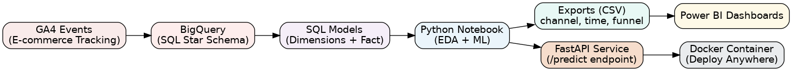
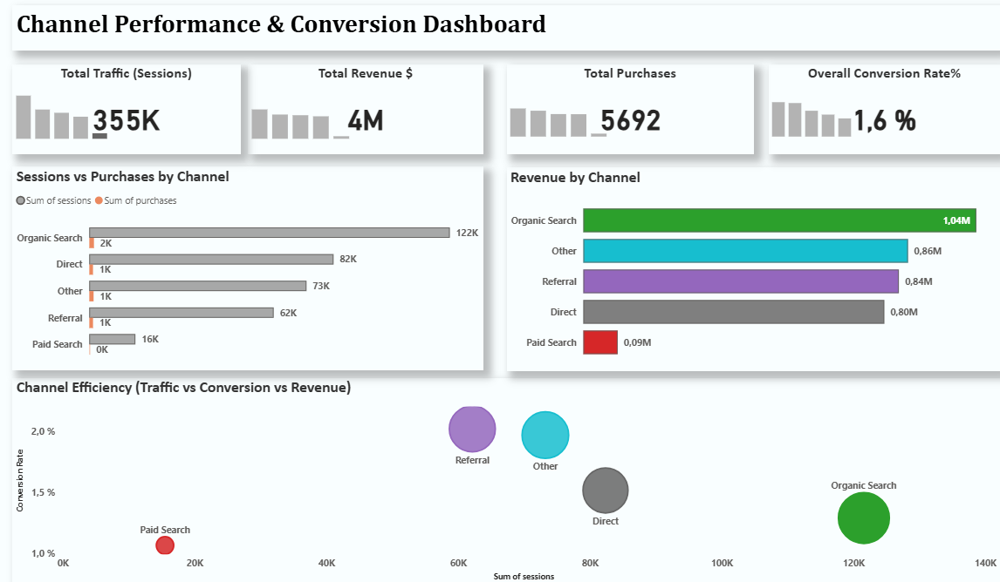

# GA4 E-commerce Analytics  End-to-End (BI · ML · API · Docker)

Turn the GA4 public sample dataset into business insights, Power BI dashboards, a trained ML model, and a FastAPI prediction service running in Docker.

---

## Preview





---

## 1) Business Case & Questions

Use GA4 e-commerce events to improve funnel conversion and channel ROI.

**Key questions**
- Which channels convert best from sessions → purchases?
- How do sessions, revenue, and conversion change by day/week/month?
- Where are the biggest drop-offs in the funnel?
- (ML) Can we predict purchase propensity from simple session features?

---

## 2) Data & ERD

**Source (BigQuery public dataset)**  
`bigquery-public-data.ga4_obfuscated_sample_ecommerce.events_*`

**Star schema**
- **dim_date** (PK = `date_pk`)
- **dim_channel** (PK = `channel_key`)
- **fact_funnel_by_date_channel**
  - FK: `date_pk` → `dim_date.date_pk`
  - FK: `channel_key` → `dim_channel.channel_key`
  - Metrics: `sessions, add_to_cart, purchases, revenue, conversion_rate, aov`

**SQL models** (`/sql`)
- `10_dim_date.sql`
- `20_dim_channel.sql`
- `30_fact_funnel_by_date_channel.sql`

**Visual ERD**  
See `images/erd.png` (rendered above).

---

## 3) Project Architecture

**Flow:** GA4 → BigQuery → SQL models → Python notebook (exports + model) → Power BI → FastAPI (Docker)

- **BigQuery** builds the star schema.
- **Notebook** creates `exports/*.csv` for BI and trains a purchase propensity model.
- **Power BI** reads exports for dashboards.
- **FastAPI** serves a `/predict` endpoint using the trained model.
- **Docker** packages the API for consistent local runs.

Diagram: `images/architecture.png` (rendered above).

---

## 4) Analysis (Python)

Notebook: `notebooks/01_eda_kpis.ipynb`

**Covers**
- Channel performance (sessions, purchases, revenue, conversion rate)
- Time trends (weekly/monthly)
- Funnel analysis (Sessions → Add to Cart → Purchases)
- Trains a **RandomForestClassifier** for purchase propensity

**Exports produced (used by BI)**
- `exports/channel_summary.csv`
- `exports/time_summary.csv`
- `exports/funnel_summary.csv`

---

## 5) Dashboard (Power BI)

- **PBIX (download):** [`dashboard/powerbi/GA4 Dashboard.pbix`](dashboard/powerbi/GA4%20Dashboard.pbix)
- **Slides (overview):** [Google Slides](https://docs.google.com/presentation/d/1xsjKvD4WlJ30uXDnL1hznrVu6tIGEO-z/edit?usp=sharing)


---

## 6) Machine Learning

Model: **RandomForestClassifier** for purchase propensity.

**Example features**
- Numeric: `sessions`, `add_to_cart`
- Categorical one-hots: `channel_group`, `day_name`, `month`

**Artifacts (`/models`)**
- `purchase_rf.joblib`
- `expected_cols.json`  ← columns used at inference

---

## 7) Prediction API (FastAPI) + Docker

**Code:** `src/api.py`

### Run locally (virtual env)
```bash
python -m venv .venv

# Windows (PowerShell)
.\.venv\Scripts\Activate.ps1

# macOS/Linux
source .venv/bin/activate

pip install -r requirements.txt
uvicorn src.api:app --host 127.0.0.1 --port 8000 --reload
```


